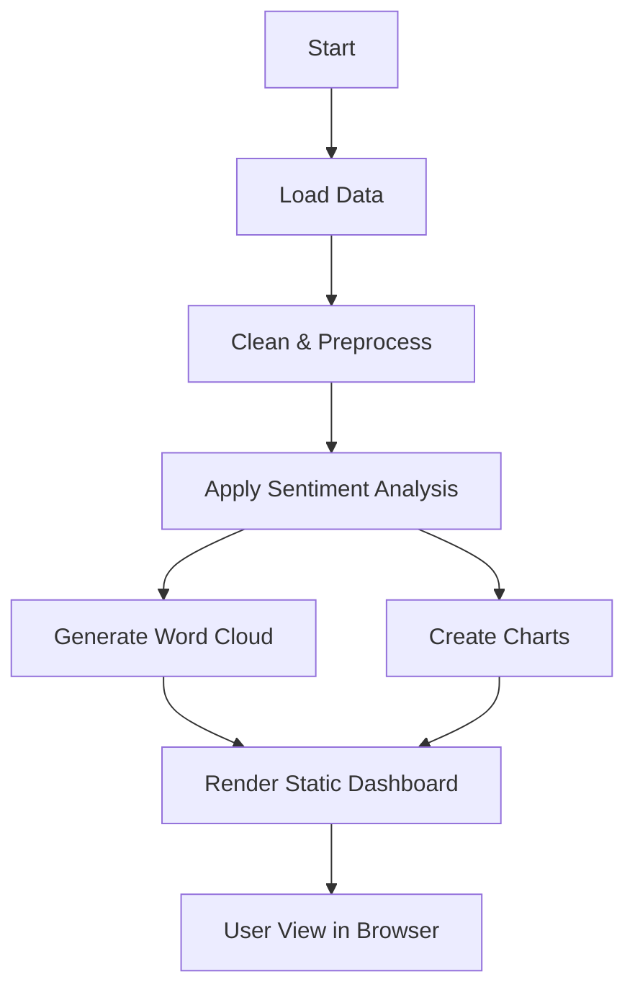

# 📣 LeapScholar Brand Perception Monitor

## 🧠 Overview

This project provides a lightweight, static web-based dashboard to monitor public sentiment and mentions about **LeapScholar** across online platforms. It aims to assist marketing teams in understanding real-time brand perception through:

- Sentiment Analysis  
- Word Cloud Visualization  
- Mention Tracking  
- Interactive Charts

## 🚀 Features

- 🔍 Tracks and summarizes sentiment (Positive, Neutral, Negative)  
- ☁️ Word cloud of frequently used terms in brand mentions  
- 📊 Pie and bar charts showing sentiment distribution and source breakdown  
- 📃 Table view of individual mentions with sentiment labels  

## 🛠️ Tech Stack

- **Frontend**: HTML5, CSS3  
- **Backend**: Python (Flask)  
- **Libraries**:  
  - `pandas`, `matplotlib`, `wordcloud`, `vaderSentiment`  
- **Data Sources**: api of Google News & Reddit

---

## 📁 Project Structure

```
LeapScholar_Brand_Perception_Monitor/
├── app.py                     # Flask application
├── static/
│   └── wordcloud.png          # Generated word cloud image
|   ├── sentiment_pie.png           
|   ├── platform_bar.png
│   └── style.css
├── templates/
│   └── index.html             # HTML Dashboard
├── README.md
└── requirements.txt
```

---

## 📊 Dashboard Preview

**Sections include:**

- ✅ **Sentiment Summary**: Total positive, negative, neutral mentions  
- ☁️ **Word Cloud**: Common keywords from user mentions  
- 📈 **Visualizations**: Pie + Bar charts  
- 🗂️ **Mentions Table**: Source-wise breakdown with sentiment tags  

---

## 🔁 Workflow Overview



---

## 💻 Running Locally

### 1️⃣ Clone the Repo

```bash
git clone https://github.com/albingeorg/LeapScholar_Brand_-Perception_-Monitor.git
cd LeapScholar_Brand_-Perception_-Monitor
```

### 2️⃣ Install Requirements

```bash
pip install -r requirements.txt
```

### 3️⃣ Run Flask App

```bash
python app.py
```

> Visit [http://127.0.0.1:5000](http://127.0.0.1:5000) to see the dashboard.

---

## 🔮 Future Enhancements

- 🔁 Live scraping from Twitter, Reddit, YouTube comments  
- 📆 Date-range filtering and time-series trend chart  
- 🌐 Deploy as a public-facing dashboard (using Heroku, Render, or GitHub Pages)  
- 🧠 Improve sentiment analysis using BERT or GPT models  

---

> Created by **Albin George** for LeapScholar Product Internship Assignment.
